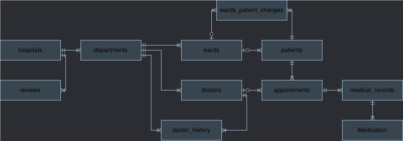
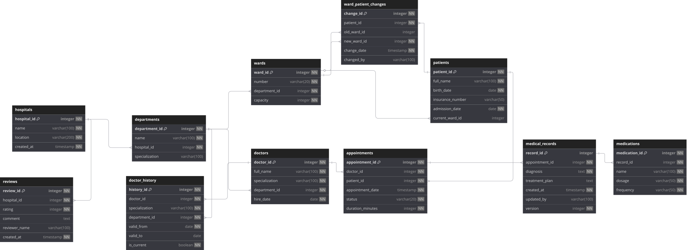

# DB_2025
## Концептуальная модель

## Логическая модель

### Нормальная форма (2NF):
- Все таблицы имеют простые ключи (id), поэтому частичных зависимостей нет — это сразу даёт 2NF. 
- Некоторые таблицы (например: medical_records) содержат поля, которые зависят не только от ключа, но и друг от друга (например, diagnosis и treatment_plan могут быть связаны). Это не нарушает 2NF, но мешает 3NF.
- В doctors: специализация (specialization) может зависеть от отделения (department_id). Например: в хирургическом отделении все врачи — хирурги). Это транзитивная зависимость, которая недопустима в 3NF.
### Версионирование:
- В таблицах doctor_history и medical_records версионирование 2 типа (SCD2) так, как необходимо хранение всех данных в мед. карте пациента и вся информация о квалификации докторов.
- В таблице  ward_patient_change версионирование 3 типа (SCD3), так как нам не нужно знать в каких палатах лежал пациент 3 года назад.
## Физическая модель
```sql
CREATE TABLE "hospitals" (
  "hospital_id" INTEGER GENERATED BY DEFAULT AS IDENTITY PRIMARY KEY NOT NULL,
  "name" varchar(100) NOT NULL,
  "location" varchar(200) NOT NULL,
  "created_at" timestamp NOT NULL DEFAULT (now())
);

CREATE TABLE "departments" (
  "department_id" INTEGER GENERATED BY DEFAULT AS IDENTITY PRIMARY KEY NOT NULL,
  "name" varchar(100) NOT NULL,
  "hospital_id" integer NOT NULL,
  "specialization" varchar(100)
);

CREATE TABLE "wards" (
  "ward_id" INTEGER GENERATED BY DEFAULT AS IDENTITY PRIMARY KEY NOT NULL,
  "number" varchar(20) NOT NULL,
  "department_id" integer NOT NULL,
  "capacity" integer NOT NULL
);

CREATE TABLE "doctors" (
  "doctor_id" INTEGER GENERATED BY DEFAULT AS IDENTITY PRIMARY KEY NOT NULL,
  "full_name" varchar(100) NOT NULL,
  "specialization" varchar(100) NOT NULL,
  "department_id" integer NOT NULL,
  "hire_date" date NOT NULL
);

CREATE TABLE "patients" (
  "patient_id" INTEGER GENERATED BY DEFAULT AS IDENTITY PRIMARY KEY NOT NULL,
  "full_name" varchar(100) NOT NULL,
  "birth_date" date NOT NULL,
  "insurance_number" varchar(50) UNIQUE,
  "admission_date" date NOT NULL,
  "current_ward_id" integer
);

CREATE TABLE "ward_patient_changes" (
  "change_id" INTEGER GENERATED BY DEFAULT AS IDENTITY PRIMARY KEY NOT NULL,
  "patient_id" integer NOT NULL,
  "old_ward_id" integer,
  "new_ward_id" integer NOT NULL,
  "change_date" timestamp NOT NULL DEFAULT (now()),
  "changed_by" varchar(100)
);

CREATE TABLE "appointments" (
  "appointment_id" INTEGER GENERATED BY DEFAULT AS IDENTITY PRIMARY KEY NOT NULL,
  "doctor_id" integer NOT NULL,
  "patient_id" integer NOT NULL,
  "appointment_date" timestamp NOT NULL,
  "status" varchar(20) NOT NULL,
  "duration_minutes" integer NOT NULL DEFAULT (30)
);

CREATE TABLE "medical_records" (
  "record_id" INTEGER GENERATED BY DEFAULT AS IDENTITY PRIMARY KEY,
  "appointment_id" integer NOT NULL,
  "diagnosis" text NOT NULL,
  "treatment_plan" text,
  "created_at" timestamp NOT NULL DEFAULT (now()),
  "updated_by" varchar(100),
  "version" integer NOT NULL DEFAULT 1
);

CREATE TABLE "medications" (
  "medication_id" INTEGER GENERATED BY DEFAULT AS IDENTITY PRIMARY KEY NOT NULL,
  "record_id" integer NOT NULL,
  "name" varchar(100) NOT NULL,
  "dosage" varchar(50) NOT NULL,
  "frequency" varchar(50) NOT NULL
);

CREATE TABLE "reviews" (
  "review_id" INTEGER GENERATED BY DEFAULT AS IDENTITY PRIMARY KEY NOT NULL,
  "hospital_id" integer NOT NULL,
  "rating" integer NOT NULL,
  "comment" text,
  "reviewer_name" varchar(100),
  "created_at" timestamp NOT NULL DEFAULT (now())
);

CREATE TABLE "doctor_history" (
  "history_id" INTEGER GENERATED BY DEFAULT AS IDENTITY PRIMARY KEY NOT NULL,
  "doctor_id" integer NOT NULL,
  "specialization" varchar(100) NOT NULL,
  "department_id" integer NOT NULL,
  "valid_from" date NOT NULL,
  "valid_to" date,
  "is_current" boolean NOT NULL DEFAULT true
);

CREATE INDEX "idx_doctor_schedule" ON "appointments" ("doctor_id", "appointment_date");

CREATE INDEX "idx_hospital_reviews" ON "reviews" ("hospital_id", "rating");

COMMENT ON COLUMN "ward_patient_changes"."changed_by" IS 'Кто инициировал перевод';

COMMENT ON COLUMN "appointments"."status" IS 'planned/completed/canceled';

COMMENT ON COLUMN "medical_records"."updated_by" IS 'Кто последним редактировал';

COMMENT ON COLUMN "medications"."frequency" IS 'Пример: ''3 раза в день''';

COMMENT ON COLUMN "reviews"."rating" IS '1-5';

ALTER TABLE "departments" ADD FOREIGN KEY ("hospital_id") REFERENCES "hospitals" ("hospital_id");

ALTER TABLE "wards" ADD FOREIGN KEY ("department_id") REFERENCES "departments" ("department_id");

ALTER TABLE "doctors" ADD FOREIGN KEY ("department_id") REFERENCES "departments" ("department_id");

ALTER TABLE "patients" ADD FOREIGN KEY ("current_ward_id") REFERENCES "wards" ("ward_id");

ALTER TABLE "ward_patient_changes" ADD FOREIGN KEY ("patient_id") REFERENCES "patients" ("patient_id");

ALTER TABLE "ward_patient_changes" ADD FOREIGN KEY ("old_ward_id") REFERENCES "wards" ("ward_id");

ALTER TABLE "ward_patient_changes" ADD FOREIGN KEY ("new_ward_id") REFERENCES "wards" ("ward_id");

ALTER TABLE "appointments" ADD FOREIGN KEY ("doctor_id") REFERENCES "doctors" ("doctor_id");

ALTER TABLE "appointments" ADD FOREIGN KEY ("patient_id") REFERENCES "patients" ("patient_id");

ALTER TABLE "medical_records" ADD FOREIGN KEY ("appointment_id") REFERENCES "appointments" ("appointment_id");

ALTER TABLE "medications" ADD FOREIGN KEY ("record_id") REFERENCES "medical_records" ("record_id");

ALTER TABLE "reviews" ADD FOREIGN KEY ("hospital_id") REFERENCES "hospitals" ("hospital_id");

ALTER TABLE "doctor_history" ADD FOREIGN KEY ("doctor_id") REFERENCES "doctors" ("doctor_id");

ALTER TABLE "doctor_history" ADD FOREIGN KEY ("department_id") REFERENCES "departments" ("department_id");
```
## Заполнение данными
```sql
INSERT INTO hospitals (name, location) VALUES
('Городская клиническая больница №1', 'Москва, ул. Ленина, 10'),
('Центральная районная больница', 'Санкт-Петербург, Невский пр., 45'),
('Областная клиническая больница', 'Новосибирск, ул. Кирова, 25'),
('Городская больница скорой помощи', 'Екатеринбург, ул. Маяковского, 15'),
('Клинический госпиталь "Медика"', 'Казань, ул. Пушкина, 30'),
('Детская городская больница №2', 'Нижний Новгород, ул. Гагарина, 5'),
('Городская больница №3', 'Самара, ул. Советская, 22'),
('Клинический центр "Здоровье"', 'Челябинск, ул. Мира, 18'),
('Городская инфекционная больница', 'Омск, ул. Лермонтова, 12'),
('Центральная городская больница', 'Ростов-на-Дону, ул. Садовая, 40'),
('Клиническая больница "Спасение"', 'Уфа, ул. Октябрьская, 8'),
('Городская больница №5', 'Красноярск, ул. Красная, 17'),
('Областной онкологический центр', 'Воронеж, ул. Плехановская, 33'),
('Городская клиника "Эскулап"', 'Пермь, ул. Куйбышева, 50'),
('Городская больница №7', 'Волгоград, ул. Рабоче-Крестьянская, 27');

INSERT INTO departments (name, hospital_id, specialization) VALUES
('Терапевтическое отделение', 1, 'Общая терапия'),
('Хирургическое отделение', 1, 'Общая хирургия'),
('Кардиологическое отделение', 1, 'Кардиология'),
('Неврологическое отделение', 2, 'Неврология'),
('Онкологическое отделение', 2, 'Онкология'),
('Ортопедическое отделение', 3, 'Ортопедия'),
('Гинекологическое отделение', 4, 'Гинекология'),
('Педиатрическое отделение', 5, 'Педиатрия'),
('Инфекционное отделение', 6, 'Инфекционные болезни'),
('Офтальмологическое отделение', 7, 'Офтальмология'),
('Отоларингологическое отделение', 8, 'ЛОР'),
('Урологическое отделение', 9, 'Урология'),
('Эндокринологическое отделение', 10, 'Эндокринология'),
('Пульмонологическое отделение', 11, 'Пульмонология'),
('Гастроэнтерологическое отделение', 12, 'Гастроэнтерология'),
('Реанимационное отделение', 13, 'Реаниматология'),
('Дерматологическое отделение', 14, 'Дерматология'),
('Психиатрическое отделение', 15, 'Психиатрия');

INSERT INTO wards (number, department_id, capacity) VALUES
('101', 1, 4), ('102', 1, 3), ('103', 1, 2),
('201', 2, 3), ('202', 2, 2), ('203', 2, 4),
('301', 3, 2), ('302', 3, 2),
('401', 4, 3), ('402', 4, 3),
('501', 5, 2), ('502', 5, 2),
('601', 6, 4), ('602', 6, 3),
('701', 7, 2), ('702', 7, 2), ('703', 7, 3),
('801', 8, 3), ('802', 8, 2),
('901', 9, 4), ('902', 9, 3),
('1001', 10, 2), ('1002', 10, 2),
('1101', 11, 3), ('1102', 11, 3),
('1201', 12, 2), ('1202', 12, 2),
('1301', 13, 4), ('1302', 13, 3),
('1401', 14, 2), ('1402', 14, 2),
('1501', 15, 3), ('1502', 15, 3);

INSERT INTO doctors (full_name, specialization, department_id, hire_date) VALUES
('Иванов Иван Иванович', 'Терапевт', 1, '2015-06-10'),
('Петрова Анна Сергеевна', 'Хирург', 2, '2018-03-15'),
('Сидоров Алексей Владимирович', 'Кардиолог', 3, '2017-11-20'),
('Кузнецова Елена Михайловна', 'Невролог', 4, '2019-05-12'),
('Смирнов Дмитрий Анатольевич', 'Онколог', 5, '2016-09-01'),
('Волкова Ольга Викторовна', 'Ортопед', 6, '2020-02-28'),
('Козлов Андрей Николаевич', 'Гинеколог', 7, '2018-07-15'),
('Никитина Татьяна Игоревна', 'Педиатр', 8, '2019-10-05'),
('Лебедев Сергей Петрович', 'Инфекционист', 9, '2017-04-18'),
('Федорова Мария Дмитриевна', 'Офтальмолог', 10, '2021-01-22'),
('Морозов Виктор Иванович', 'ЛОР', 11, '2018-11-30'),
('Григорьева Надежда Павловна', 'Уролог', 12, '2019-08-14'),
('Борисов Артем Валерьевич', 'Эндокринолог', 13, '2020-03-25'),
('Павлова Екатерина Александровна', 'Пульмонолог', 14, '2017-12-10'),
('Семенов Игорь Олегович', 'Гастроэнтеролог', 15, '2019-06-20'),
('Михайлова Татьяна Сергеевна', 'Реаниматолог', 16, '2018-09-05'),
('Новиков Александр Дмитриевич', 'Дерматолог', 17, '2020-04-15'),
('Соколова Юлия Викторовна', 'Психиатр', 18, '2019-02-12');

INSERT INTO patients (full_name, birth_date, insurance_number, admission_date, current_ward_id) VALUES
('Алексеев Михаил Сергеевич', '1980-05-15', 'INS12345678', '2024-01-10', 1),
('Белова Анна Викторовна', '1992-08-23', 'INS23456789', '2024-01-12', 2),
('Васильев Дмитрий Игоревич', '1975-11-30', 'INS34567890', '2024-01-15', 3),
('Громова Екатерина Алексеевна', '1988-03-17', 'INS45678901', '2024-01-18', 4),
('Дмитриев Павел Олегович', '1995-07-22', 'INS56789012', '2024-01-20', 5),
('Егорова Ольга Николаевна', '1983-09-14', 'INS67890123', '2024-01-22', 6),
('Жуков Андрей Владимирович', '1978-12-05', 'INS78901234', '2024-01-25', 7),
('Зайцева Ирина Петровна', '1990-04-19', 'INS89012345', '2024-01-28', 8),
('Ильин Сергей Дмитриевич', '1987-06-27', 'INS90123456', '2024-01-30', 9),
('Ковалева Марина Александровна', '1972-10-08', 'INS01234567', '2024-02-02', 10),
('Ларин Виктор Михайлович', '1985-02-11', 'INS12345098', '2024-02-05', 11),
('Максимова Наталья Сергеевна', '1993-05-24', 'INS23450987', '2024-02-08', 12),
('Николаев Артем Викторович', '1981-08-16', 'INS34509876', '2024-02-10', 13),
('Орлова Дарья Игоревна', '1976-01-29', 'INS45098765', '2024-02-12', 14),
('Петухов Иван Алексеевич', '1998-07-03', 'INS50987654', '2024-02-15', 15),
('Романова Светлана Владимировна', '1989-03-18', 'INS09876543', '2024-02-18', 16),
('Степанов Алексей Николаевич', '1973-12-22', 'INS98765432', '2024-02-20', 17),
('Тихонова Елена Михайловна', '1984-09-07', 'INS87654321', '2024-02-22', 18),
('Устинов Денис Олегович', '1991-04-13', 'INS76543210', '2024-02-25', 19),
('Фролова Анна Дмитриевна', '1979-11-26', 'INS65432109', '2024-02-28', 20);

INSERT INTO reviews (hospital_id, rating, comment, reviewer_name) VALUES
(1, 5, 'Отличное обслуживание, внимательные врачи', 'Анна'),
(1, 4, 'Хорошая больница, но очереди', 'Сергей'),
(2, 5, 'Лучшие специалисты в городе', 'Мария'),
(2, 3, 'Долго ждали приема', 'Дмитрий'),
(3, 4, 'Чисто, современное оборудование', 'Ольга'),
(3, 5, 'Спасли жизнь, низкий поклон', 'Алексей'),
(4, 2, 'Не хватает персонала', 'Ирина'),
(4, 4, 'Хорошие условия для пациентов', 'Андрей'),
(5, 5, 'Отличный сервис, европейский уровень', 'Екатерина'),
(5, 3, 'Дорого, но качественно', 'Виктор'),
(6, 4, 'Хорошая детская больница', 'Наталья'),
(6, 5, 'Врачи нашли подход к ребенку', 'Артем'),
(7, 3, 'Средний уровень обслуживания', 'Дарья'),
(7, 4, 'Понравилось отношение медсестер', 'Иван'),
(8, 5, 'Лучшая клиника в регионе', 'Светлана'),
(8, 4, 'Профессиональные врачи', 'Алексей'),
(9, 2, 'Старое оборудование', 'Елена'),
(9, 3, 'Нормально, но могло быть лучше', 'Денис'),
(10, 5, 'Отличные специалисты', 'Анна'),
(10, 4, 'Хорошие условия стационара', 'Павел');

INSERT INTO appointments (doctor_id, patient_id, appointment_date, status, duration_minutes) VALUES
(1, 1, '2024-03-01 09:00:00', 'completed', 30),
(1, 2, '2024-03-01 10:00:00', 'completed', 45),
(1, 3, '2024-03-02 11:00:00', 'completed', 30),
(2, 4, '2024-03-02 14:00:00', 'completed', 60),
(2, 5, '2024-03-03 10:30:00', 'completed', 45),
(3, 6, '2024-03-03 12:00:00', 'completed', 30),
(3, 7, '2024-03-04 09:00:00', 'completed', 45),
(4, 8, '2024-03-04 11:00:00', 'completed', 60),
(4, 9, '2024-03-05 13:00:00', 'completed', 30),
(5, 10, '2024-03-05 15:00:00', 'completed', 45),
(5, 11, '2024-03-06 10:00:00', 'completed', 60),
(6, 12, '2024-03-06 12:00:00', 'completed', 30),
(6, 13, '2024-03-07 09:30:00', 'completed', 45),
(7, 14, '2024-03-07 11:30:00', 'completed', 30),
(7, 15, '2024-03-08 14:00:00', 'completed', 60),
(8, 16, '2024-03-08 16:00:00', 'completed', 30),
(8, 17, '2024-03-09 09:00:00', 'completed', 45),
(9, 18, '2024-03-09 11:00:00', 'completed', 30),
(9, 19, '2024-03-10 13:30:00', 'completed', 60),
(10, 20, '2024-03-10 15:30:00', 'completed', 30),
(10, 1, '2024-03-11 10:00:00', 'planned', 45),
(11, 2, '2024-03-11 12:00:00', 'planned', 30),
(11, 3, '2024-03-12 14:00:00', 'planned', 60),
(12, 4, '2024-03-12 16:00:00', 'planned', 30),
(12, 5, '2024-03-13 09:30:00', 'planned', 45),
(13, 6, '2024-03-13 11:30:00', 'planned', 30),
(13, 7, '2024-03-14 13:00:00', 'planned', 60),
(14, 8, '2024-03-14 15:00:00', 'planned', 30),
(15, 9, '2024-03-15 10:30:00', 'planned', 45),
(15, 10, '2024-03-15 12:30:00', 'planned', 30);

INSERT INTO medical_records (appointment_id, diagnosis, treatment_plan, updated_by, version) VALUES
(1, 'ОРВИ', 'Постельный режим, обильное питье, парацетамол', 'Иванов И.И.', 1),
(2, 'Гипертоническая болезнь', 'Диета, ограничение соли, амлодипин 5 мг', 'Иванов И.И.', 1),
(3, 'Гастрит', 'Диета №1, омепразол 20 мг утром', 'Иванов И.И.', 1),
(4, 'Аппендицит', 'Экстренная аппендэктомия', 'Петрова А.С.', 1),
(5, 'Перелом лодыжки', 'Гипсовая иммобилизация на 4 недели', 'Петрова А.С.', 1),
(6, 'ИБС, стенокардия', 'Нитроглицерин при болях, аспирин 100 мг', 'Сидоров А.В.', 1),
(7, 'Гипертонический криз', 'Капельница с магнезией, постельный режим', 'Сидоров А.В.', 1),
(8, 'Остеохондроз', 'ЛФК, массаж, диклофенак 50 мг', 'Кузнецова Е.М.', 1),
(9, 'Мигрень', 'Суматриптан при приступах, режим сна', 'Кузнецова Е.М.', 1),
(10, 'Рак молочной железы', 'Химиотерапия по схеме AC', 'Смирнов Д.А.', 1),
(11, 'Меланома', 'Хирургическое иссечение', 'Смирнов Д.А.', 1),
(12, 'Сколиоз 2 степени', 'Корсет, плавание, ЛФК', 'Волкова О.В.', 1),
(13, 'Артроз коленного сустава', 'Хондропротекторы, ограничение нагрузки', 'Волкова О.В.', 1),
(14, 'Миома матки', 'Гормональная терапия, наблюдение', 'Козлов А.Н.', 1),
(15, 'Беременность 12 недель', 'Фолиевая кислота, УЗИ контроль', 'Козлов А.Н.', 1),
(16, 'Атопический дерматит', 'Гидрокортизоновая мазь, эмоленты', 'Никитина Т.И.', 1),
(17, 'Бронхит', 'Амоксициллин, ингаляции', 'Никитина Т.И.', 1),
(18, 'Грипп', 'Осельтамивир, постельный режим', 'Лебедев С.П.', 1),
(19, 'COVID-19', 'Изоляция, мониторинг сатурации', 'Лебедев С.П.', 1),
(20, 'Катаракта', 'Планирование факоэмульсификации', 'Федорова М.Д.', 1),
(21, 'Конъюнктивит', 'Капли левомицетин', 'Федорова М.Д.', 1),
(22, 'Отит', 'Антибиотики, капли отипакс', 'Морозов В.И.', 1),
(23, 'Гайморит', 'Пункция гайморовой пазухи', 'Морозов В.И.', 1),
(24, 'Цистит', 'Фурадонин, обильное питье', 'Григорьева Н.П.', 1),
(25, 'Мочекаменная болезнь', 'Литолиз, диета №6', 'Григорьева Н.П.', 1),
(26, 'Сахарный диабет 2 типа', 'Метформин 1000 мг, диета', 'Борисов А.В.', 1),
(27, 'Гипотиреоз', 'L-тироксин 50 мкг', 'Борисов А.В.', 1),
(28, 'Бронхиальная астма', 'Сальбутамол ингаляционно', 'Павлова Е.А.', 1),
(29, 'Пневмония', 'Антибиотикотерапия цефтриаксоном', 'Павлова Е.А.', 1),
(30, 'Язва желудка', 'Омепразол, диета №1', 'Семенов И.О.', 1);

INSERT INTO medications (record_id, name, dosage, frequency) VALUES
(1, 'Парацетамол', '500 мг', '3 раза в день'),
(2, 'Амлодипин', '5 мг', '1 раз утром'),
(3, 'Омепразол', '20 мг', '1 раз утром'),
(4, 'Цефтриаксон', '1 г', '2 раза в день внутримышечно'),
(5, 'Кальций-Д3', '1 таблетка', '2 раза в день'),
(6, 'Аспирин', '100 мг', '1 раз утром'),
(7, 'Магния сульфат', '25% 10 мл', '1 раз внутривенно'),
(8, 'Диклофенак', '50 мг', '2 раза в день'),
(9, 'Суматриптан', '50 мг', 'по необходимости'),
(10, 'Доксорубицин', '60 мг/м2', '1 раз в 3 недели'),
(11, 'Циклофосфамид', '600 мг/м2', '1 раз в 3 недели'),
(12, 'Глюкозамин', '1500 мг', '1 раз в день'),
(13, 'Хондроитин', '1200 мг', '1 раз в день'),
(14, 'Дюфастон', '10 мг', '2 раза в день'),
(15, 'Фолиевая кислота', '400 мкг', '1 раз в день'),
(16, 'Гидрокортизоновая мазь', '1%', '2 раза в день'),
(17, 'Амоксициллин', '500 мг', '3 раза в день'),
(18, 'Осельтамивир', '75 мг', '2 раза в день'),
(19, 'Азитромицин', '500 мг', '1 раз в день'),
(20, 'Левомицетин', '0.25%', '3 раза в день'),
(21, 'Отипакс', '4 капли', '3 раза в день'),
(22, 'Фурадонин', '100 мг', '3 раза в день'),
(23, 'Аллопуринол', '300 мг', '1 раз в день'),
(24, 'Метформин', '1000 мг', '2 раза в день'),
(25, 'L-тироксин', '50 мкг', '1 раз утром'),
(26, 'Сальбутамол', '100 мкг', 'по необходимости'),
(27, 'Цефтриаксон', '1 г', '1 раз в день внутримышечно'),
(28, 'Омепразол', '20 мг', '2 раза в день'),
(29, 'Де-Нол', '120 мг', '4 раза в день'),
(30, 'Амоксициллин', '1000 мг', '2 раза в день');

INSERT INTO doctor_history (doctor_id, specialization, department_id, valid_from, valid_to, is_current) VALUES
(1, 'Терапевт', 1, '2015-06-10', '2018-06-09', false),
(1, 'Кардиолог', 3, '2018-06-10', '2020-12-31', false),
(1, 'Терапевт', 1, '2021-01-01', NULL, true),
(2, 'Хирург', 2, '2018-03-15', '2020-05-20', false),
(2, 'Хирург', 4, '2020-05-21', NULL, true),
(3, 'Кардиолог', 3, '2017-11-20', '2019-08-15', false),
(3, 'Кардиохирург', 5, '2019-08-16', '2021-03-10', false),
(3, 'Кардиолог', 3, '2021-03-11', NULL, true),
(4, 'Невролог', 4, '2019-05-12', '2020-11-30', false),
(4, 'Нейрохирург', 6, '2020-12-01', NULL, true),
(5, 'Онколог', 5, '2016-09-01', '2018-04-15', false),
(5, 'Химиотерапевт', 7, '2018-04-16', '2020-02-28', false),
(5, 'Онколог', 5, '2020-03-01', NULL, true),
(6, 'Ортопед', 6, '2020-02-28', '2021-07-15', false),
(6, 'Травматолог', 8, '2021-07-16', NULL, true),
(7, 'Гинеколог', 7, '2018-07-15', '2020-01-10', false),
(7, 'Акушер-гинеколог', 9, '2020-01-11', NULL, true),
(8, 'Педиатр', 8, '2019-10-05', '2021-05-20', false),
(8, 'Неонатолог', 10, '2021-05-21', NULL, true),
(9, 'Инфекционист', 9, '2017-04-18', '2019-03-22', false),
(9, 'Вирусолог', 11, '2019-03-23', '2021-12-31', false),
(9, 'Инфекционист', 9, '2022-01-01', NULL, true),
(10, 'Офтальмолог', 10, '2021-01-22', '2022-06-30', false),
(10, 'Офтальмохирург', 12, '2022-07-01', NULL, true),
(11, 'ЛОР', 11, '2018-11-30', '2020-08-15', false),
(11, 'Оториноларинголог', 13, '2020-08-16', NULL, true),
(12, 'Уролог', 12, '2019-08-14', '2021-02-28', false),
(12, 'Андролог', 14, '2021-03-01', NULL, true),
(13, 'Эндокринолог', 13, '2020-03-25', '2021-09-10', false),
(13, 'Диабетолог', 15, '2021-09-11', NULL, true);

INSERT INTO ward_patient_changes (patient_id, old_ward_id, new_ward_id, change_date, changed_by) VALUES
(1, NULL, 1, '2024-01-10 08:00:00', 'admin'),
(1, 1, 3, '2024-01-12 10:30:00', 'nurse1'),
(1, 3, 5, '2024-01-15 09:15:00', 'nurse2'),
(2, NULL, 2, '2024-01-12 09:30:00', 'admin'),
(2, 2, 4, '2024-01-14 11:20:00', 'nurse1'),
(3, NULL, 3, '2024-01-15 10:45:00', 'admin'),
(3, 3, 1, '2024-01-17 14:00:00', 'nurse3'),
(4, NULL, 4, '2024-01-18 08:30:00', 'admin'),
(4, 4, 6, '2024-01-20 16:45:00', 'nurse2'),
(5, NULL, 5, '2024-01-20 11:15:00', 'admin'),
(5, 5, 7, '2024-01-22 10:00:00', 'nurse1'),
(6, NULL, 6, '2024-01-22 09:00:00', 'admin'),
(6, 6, 8, '2024-01-24 15:30:00', 'nurse3'),
(7, NULL, 7, '2024-01-25 10:20:00', 'admin'),
(7, 7, 9, '2024-01-27 11:45:00', 'nurse2'),
(8, NULL, 8, '2024-01-28 08:45:00', 'admin'),
(8, 8, 10, '2024-01-30 14:15:00', 'nurse1'),
(9, NULL, 9, '2024-01-30 09:30:00', 'admin'),
(9, 9, 11, '2024-02-01 16:00:00', 'nurse3'),
(10, NULL, 10, '2024-02-02 10:10:00', 'admin'),
(10, 10, 12, '2024-02-04 11:30:00', 'nurse2'),
(11, NULL, 11, '2024-02-05 08:20:00', 'admin'),
(11, 11, 13, '2024-02-07 15:45:00', 'nurse1'),
(12, NULL, 12, '2024-02-08 09:40:00', 'admin'),
(12, 12, 14, '2024-02-10 14:30:00', 'nurse3'),
(13, NULL, 13, '2024-02-10 10:50:00', 'admin'),
(13, 13, 15, '2024-02-12 16:15:00', 'nurse2'),
(14, NULL, 14, '2024-02-12 08:35:00', 'admin'),
(14, 14, 16, '2024-02-14 11:50:00', 'nurse1'),
(15, NULL, 15, '2024-02-15 09:25:00', 'admin'),
(15, 15, 17, '2024-02-17 15:00:00', 'nurse3');
```
## Запросы
### Найти всех пациентов, поступивших после 1 марта 2024
```sql
SELECT full_name, admission_date
FROM patients
WHERE admission_date > '2024-03-01';
```
### Количество пациентов в каждом отделении
```sql
SELECT d.name AS department, COUNT(p.patient_id) AS patient_count
FROM departments d
JOIN wards w ON w.department_id = d.department_id
JOIN patients p ON p.current_ward_id = w.ward_id
GROUP BY d.name;
```
### Врачи, у которых больше 5 приёмов
```sql
SELECT d.full_name, COUNT(a.appointment_id) AS total_appointments
FROM doctors d
JOIN appointments a ON d.doctor_id = a.doctor_id
GROUP BY d.full_name
HAVING COUNT(a.appointment_id) > 5;
```
### Список приёмов с диагнозами
```sql
SELECT p.full_name, a.appointment_date, mr.diagnosis
FROM appointments a
JOIN patients p ON a.patient_id = p.patient_id
JOIN medical_records mr ON mr.appointment_id = a.appointment_id
ORDER BY a.appointment_date DESC;
```
### Пациенты, у которых были приёмы у врача "Иванов И.И."
```sql
SELECT full_name
FROM patients
WHERE patient_id IN (
    SELECT patient_id
    FROM appointments a
    JOIN doctors d ON a.doctor_id = d.doctor_id
    WHERE d.full_name = 'Иванов Иван Иванович'
);
```
### Пациенты, у которых есть хотя бы один диагноз "Грипп"
```sql
SELECT p.full_name
FROM patients p
WHERE EXISTS (
    SELECT 1
    FROM appointments a
    JOIN medical_records mr ON a.appointment_id = mr.appointment_id
    WHERE a.patient_id = p.patient_id AND mr.diagnosis ILIKE '%Грипп%'
);
```
### Последний перевод каждого пациента
```sql
SELECT *
FROM (
    SELECT *, ROW_NUMBER() OVER (PARTITION BY patient_id ORDER BY change_date DESC) AS rn
    FROM ward_patient_changes
) sub
WHERE rn = 1;
```
### Оценка средних рейтингов больниц
```sql
SELECT hospital_id, AVG(rating) OVER (PARTITION BY hospital_id) AS avg_rating
FROM reviews;
```
### Топ-3 врача по количеству приёмов
```sql
SELECT d.full_name, COUNT(a.appointment_id) AS total_appointments
FROM doctors d
JOIN appointments a ON d.doctor_id = a.doctor_id
GROUP BY d.full_name
ORDER BY total_appointments DESC
LIMIT 3;
```
### Назначения с длительностью выше средней
```sql
SELECT *
FROM appointments
WHERE duration_minutes > (
    SELECT AVG(duration_minutes) FROM appointments
);
```
# Created by Safonov Artyom | SUSU